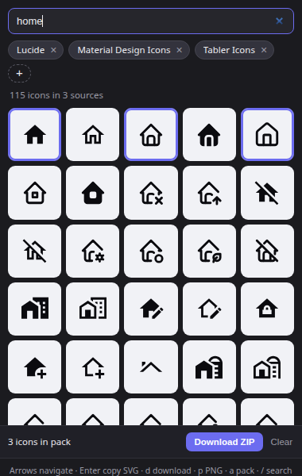
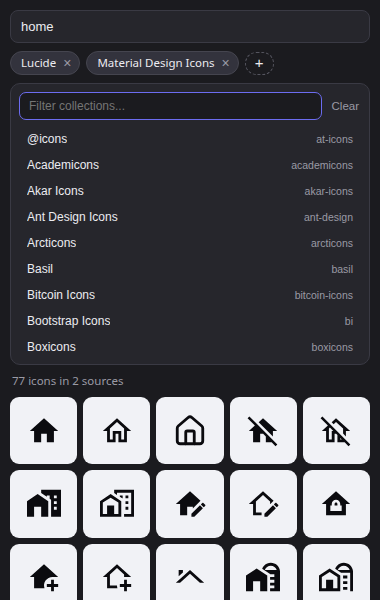

# Iconify Picker

Extensión de navegador para buscar entre los **+200.000 iconos open source** de [Iconify](https://iconify.design) y copiarlos al instante. Sin descargas, sin marcas de agua, sin licencias.

## Características

- Busca en **238 colecciones** (Lucide, Tabler, Material Symbols, Phosphor, Ant Design, MDI y muchas más).
- **Varios sources a la vez**: agrega colecciones como *pills* y busca solo en esas.
- **Navegación por teclado** completa.
- **Clic** en un icono → copia el **código SVG** (negro) al portapapeles.
- **↓** → descarga el `.svg`.
- **PNG** → copia el icono como **imagen**, para pegarlo directo con Ctrl+V en Canva, Figma, etc.
- Interfaz en **español e inglés** (según el idioma del navegador).

## Instalación

### Firefox

**Permanente (recomendado):** descarga el `.xpi` firmado desde [Releases](https://github.com/italovisconti/iconify-picker/releases/latest) y ábrelo con Firefox (o arrástralo a una ventana). Confirma la instalación. Al estar firmado por Mozilla, queda instalado de forma permanente.

**Temporal (para probar):**
1. Abre `about:debugging#/runtime/this-firefox`
2. *Cargar complemento temporal* → elige `manifest.json`

Requiere Firefox **142 o superior**.

### Chrome / Edge / Brave

1. Abre `chrome://extensions`
2. Activa **Modo desarrollador**
3. *Cargar descomprimida* → elige la carpeta `iconify-picker`

## Uso

1. Escribe qué buscas (`home`, `arrow`, `user`...).
2. Opcional: toca **+** y agrega las colecciones donde quieres buscar. Sin pills, busca en todas.
3. Haz clic en un icono para copiar su SVG, o usa los botones **↓** / **PNG**.

La selección de sources se recuerda entre sesiones.

## Atajos de teclado

| Tecla | Acción |
| --- | --- |
| `/` | Ir al buscador |
| `↓` (en el buscador) | Entrar a la grilla |
| `←` `↑` `↓` `→` | Moverse entre iconos |
| `Home` / `End` | Primer / último icono |
| `PageUp` / `PageDown` | Saltar una pantalla |
| `Enter` | Copiar el SVG del icono enfocado |
| `d` | Descargar el SVG |
| `p` | Copiar como PNG |
| `Esc` | Volver al buscador / cerrar el selector |

## Idiomas

La interfaz se adapta automáticamente al idioma del navegador (español o inglés). Para agregar otro idioma basta con crear una carpeta en `_locales/` con su `messages.json`.

## Privacidad

No recopila ni envía datos. Solo consulta la API pública de [Iconify](https://iconify.design) (`api.iconify.design`).

## Inspiración

Está inspirada en la extensión para Chrome **Iconify Search Extension** ([Chrome Web Store](https://chromewebstore.google.com/detail/iconify-search-extension/giledbfknmilhcidlelgochpiohilhhc)), de la que me gustó la idea del buscador en un popup.

## Licencia

[MIT](LICENSE).

## Créditos

- Iconos: [Iconify](https://iconify.design) — cada colección mantiene su licencia original (la mayoría MIT).
- API: [Iconify API](https://iconify.design/docs/api/).
